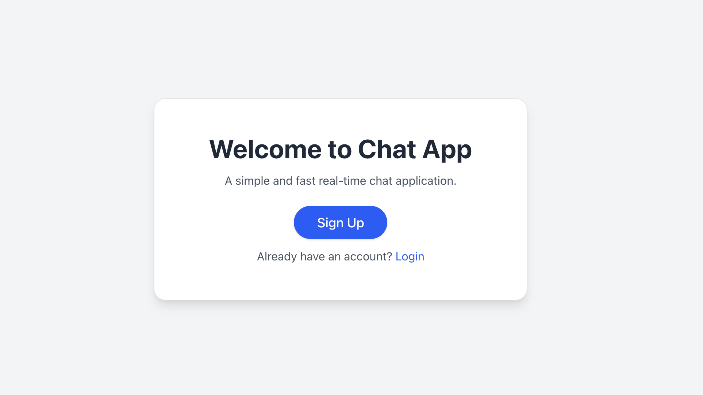
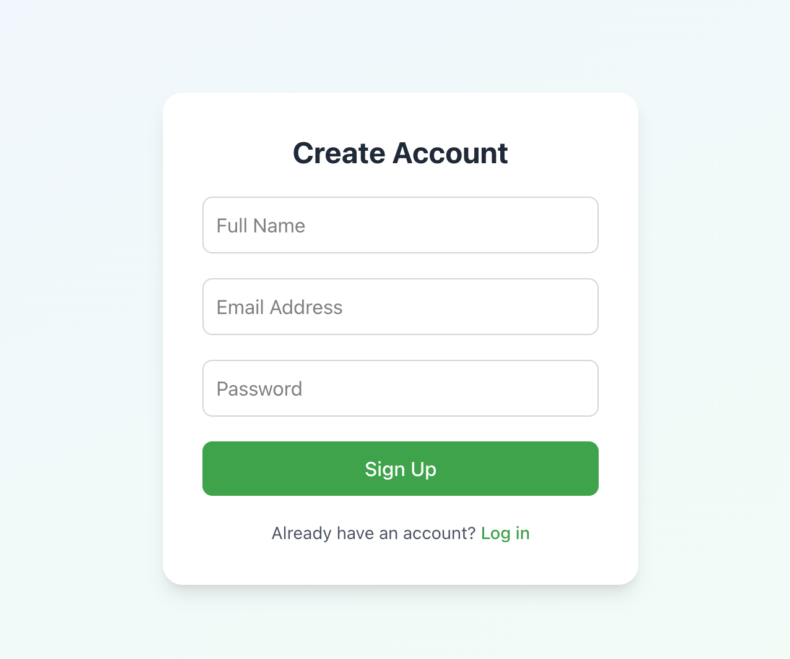
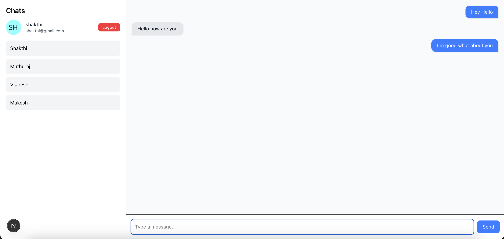
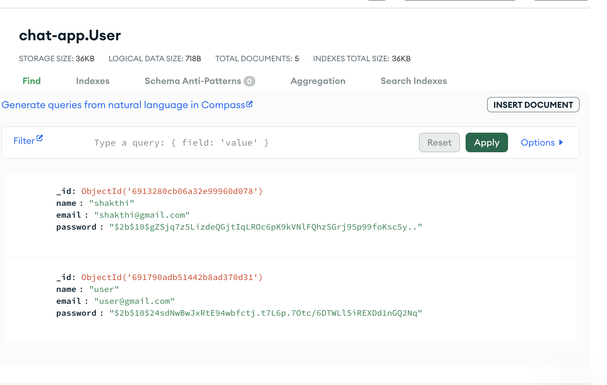

Real-Time Chat App

A fully functional real-time chat application built using Next.js, Tailwind CSS, Socket.IO, Node.js, and MongoDB.
This project delivers an instant messaging experience with user authentication, live chat updates, and a clean responsive UI.

🔗 Live Demo: https://real-time-chat-ft26.onrender.com/

About the Project

A beautifully designed real-time chat application that focuses on:

1 Speed
2 Simplicity
3 Clean UI
4 Smooth message sending
5 Secure authentication

Built fully from scratch using Next.js App Router, Socket.IO, and Prisma + MongoDB.

This project is perfect for anyone who wants to learn:

Real-time WebSocket communication

Next.js custom Node server

Authentication with NextAuth

Clean responsive UI with Tailwind

Deployment on Render

Tech Stack

Frontend: Next.js, React, Tailwind CSS
Backend: Node.js, Socket.IO
Auth: NextAuth.js
Database: MongoDB (Prisma ORM)
Tools: Git & GitHub, TypeScript
Hosting: Render (Web Service)

Features:

Instant real-time messaging (Socket.IO)

Secure login & logout (NextAuth)

Auto-generated profile avatars

Smooth and clean chat UI

Fully responsive on mobile

Modern Tailwind design

Custom Node.js server for WebSockets

Hosted on Render with CI/CD

Screenshots: 

### Home Page

<!--  -->

### Register/Signup Page

### Layout(App UI) Page

### Mongodb data Page (How user data are stored in mongodb) 

Installation & Setup:
1. Clone the repo:
git clone https://github.com/your-username/real-time-chatgit
cd real-time-chat

2. Install dependencies:
npm install

3. Generate Prisma Client:
npx prisma generate

4. Start development server:
npm run dev 

Environment Variables
.env:
DATABASE_URL="your-mongodb-url"

.env.local:
NEXTAUTH_SECRET="your-secret-key"
NEXTAUTH_URL="http://localhost:3000"

Deployment on Rende: 
Build Command:
npm install && npx prisma generate && npm run build

Start Command:
node server.js

Add Environment Variables

DATABASE_URL

NEXTAUTH_SECRET

NEXTAUTH_URL

Then click Deploy 

Future Enhancements :

One-to-one private chats
Typing indicator
Online users list
Message read receipts
Storing chat history

Author:
Built with ❤️ by Shakthivel

